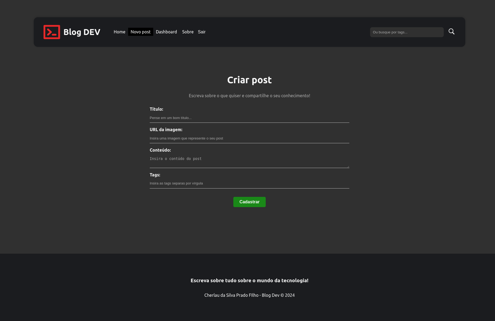
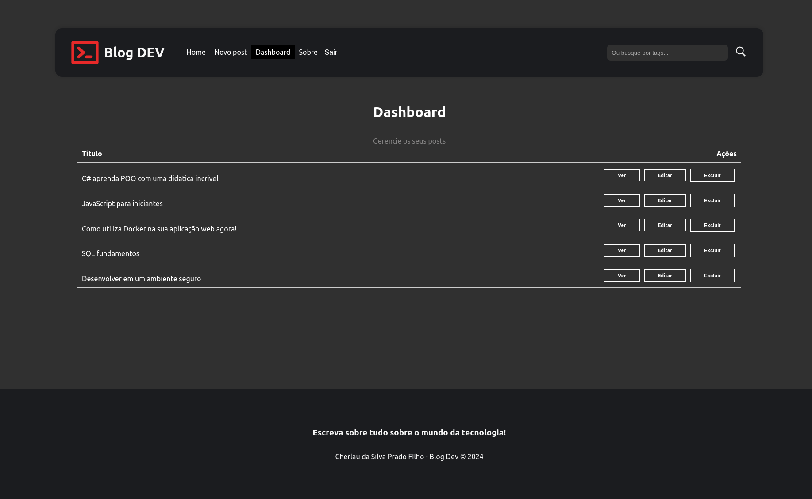

<h1 align="center">Blog para desenvolvedores feito em React</h1> 

<h3 align="center">
⚙️ Tecnologias utilizadas

&nbsp;

</h3>

 

##   Funcionalidades

* <strong>Banco de dados Firebase</strong> 
* <strong>Cadastrar de usuário</strong> 
* <strong>Login de usuário</strong>
* <strong>Cadastro de posts</strong>
* <strong>Ver post completo</strong>
* <strong>Alterar post</strong>
* <strong>Excluir post</strong> 
* <strong>Pesquisar Post</strong> 
  
* <a href="https://blogdev-1e8d3.web.app/" target="_blank"><h4>Confira o projeto hospedado no firebase: https://blogdev-1e8d3.web.app/</h3></a>

 
 

## 🚧 Projeto

  

  

  

  

  

&nbsp;

---

## ✒️ Autor

| [    Cherlau Prado ](https://github.com/cherPrado) |
| :--------------------------------------------------------------------------------------------------------------------------------------------: |

<h2 >Entre em contato 🤙🏽</h2>

